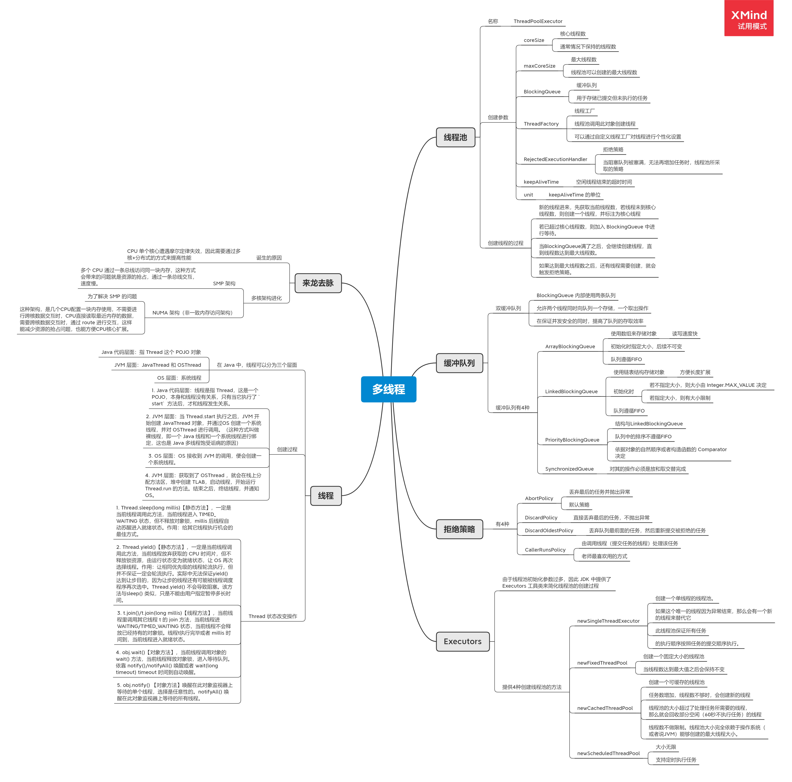
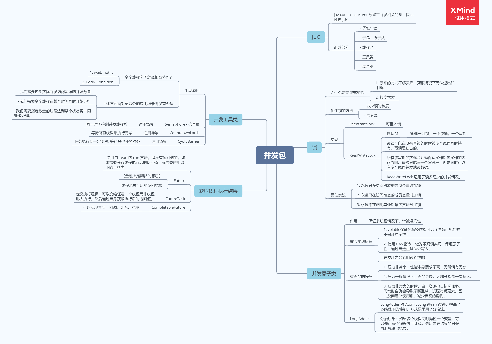

# 学习笔记

## 第二题-线程异步执行的方式

题目：思考有多少种方式，在 main 函数启动一个新线程，运行一个方法，拿到这个方法的返回值后，退出主线程。

### 答案

#### Future

```JAVA
/**
  * 新建一个线程池,通过 submit 方法获取一个 Future，从而获取返回值
  */
public static int sumByFuture(){
    ExecutorService service = Executors.newSingleThreadExecutor();
    Future<Integer> result = service.submit(Homework03::sum);
    try {
        return result.get();
    } catch (InterruptedException | ExecutionException e) {
        return 0;
    } finally {
        service.shutdown();
    }
}
```

### FutureTask By Thread

```JAVA
    /**
     * 创建一个 FutureTask，新建一个线程来执行
     */
    public static int sumByFutureTaskAndThread() {
        FutureTask<Integer> result = new FutureTask<>(Homework03::sum);
        new Thread(result).start();
        try {
            return result.get();
        } catch (InterruptedException | ExecutionException e) {
            return 0;
        }
    }
```

### FutureTask By Executor

```JAVA
    /**
     * 创建一个 FutureTask，新建一个线程池来执行
     */
    public static int sumByFutureTaskAndExecutor() {
        FutureTask<Integer> result = new FutureTask<>(Homework03::sum);
        ExecutorService service = Executors.newCachedThreadPool();
        service.execute(result);
        try {
            return result.get();
        } catch (InterruptedException | ExecutionException e) {
            return 0;
        } finally {
            service.shutdown();
        }
    }
```

### `CompletableFuture.supplyAsync`

```JAVA
    /**
     * 通过 CompletableFuture.supplyAsync 来开启线程池
     */
    public static int sumByCompletableFuture(){
        try {
            return CompletableFuture.supplyAsync(Homework03::sum).get();
        } catch (InterruptedException | ExecutionException e) {
            return 0;
        }
    }
```


## 第四题-多线程与并发知识梳理

题目：把多线程和并发相关知识带你梳理一遍，画一个脑图，截图上传到 Github 上。

### 多线程




### 并发包

