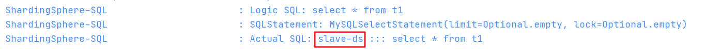
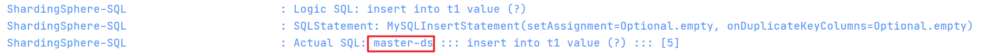

# 学习笔记

## 周四-第二题

题目：按自己设计的表结构，插入 100 万订单模拟数据，测试不同方式的插入效率


## 周六-第二题

题目：读写分离 - 动态切换数据源版本 1.0

### 答案

代码在 `multiple-datasource-01` 项目中，本次使用 Spring Boot、Druid、spring JDBC template 来实现。

#### 配置多个数据源

首先在`application.properties`中配置数据源

```properties
spring.datasource.master.url=jdbc:mysql://localhost:3306/db?useUnicode=true&characterEncoding=utf-8
spring.datasource.master.username=root
spring.datasource.master.password=
spring.datasource.master.type=com.alibaba.druid.pool.DruidDataSource

spring.datasource.slave.url=jdbc:mysql://localhost:3316/db?useUnicode=true&characterEncoding=utf-8
spring.datasource.slave.username=root
spring.datasource.slave.password=
spring.datasource.slave.type=com.alibaba.druid.pool.DruidDataSource
```

这里通过 master 和 slave 来对数据源的配置进行区分，但是这样就会使得 Spring Boot 的自动配置失效，因此，需要通过创建配置类来进行手动配置两个数据源：

```java
@Configuration
public class DataSourceConfig {

    @Bean
    @ConfigurationProperties(prefix = "spring.datasource.master")
    DataSource master(){
        return DruidDataSourceBuilder.create().build();
    }

    @Bean
    @ConfigurationProperties(prefix = "spring.datasource.slave")
    DataSource slave(){
        return DruidDataSourceBuilder.create().build();
    }

}
```

通过 `@ConfigurationProperties` 来指定每个 bean 使用哪个数据源进行配置。

#### 配置多个 JDBC Template

有了多个数据源，我们再创建多个 `jdbcTemplate`，给每个 `jdbcTemplate` 指定不同的数据源，这样就可以通过不同的 `jdbcTemplate` 操作不同的数据库了。

```java
@Configuration
public class JdbcTemplateConfig {

    @Bean
    JdbcTemplate masterTemplate(@Qualifier("master")DataSource dataSource){
        return new JdbcTemplate(dataSource);
    }

    @Bean
    JdbcTemplate slaveTemplate(@Qualifier("slave")DataSource dataSource){
        return new JdbcTemplate(dataSource);
    }
}
```

这里，由于当前 Spring 容器中存在两个 `DataSource` 实例，因此需要通过  `@Qualifier` 注解，来按实例名指定注入的 `DataSource` 实例。

#### 封装DAO层

有了两个 `jdbcTemplate`，我们就可以封装一个 DAO 层，根据不同的操作，使用不同的数据源。

```java
@Repository
public class UserManagerImpl implements UserManager {
    @Resource(name = "masterTemplate")
    private JdbcTemplate masterTemplate;

    @Resource(name = "slaveTemplate")
    private JdbcTemplate slaveTemplate;

    @Override
    public List<User> listUser() {
        return slaveTemplate.query("select * from t1", new BeanPropertyRowMapper<>(User.class));
    }

    @Override
    public int insert(int id) {
        return masterTemplate.update("insert into t1 value (?)", id);
    }
}
```

和`DataSource`一样，Spring容器中的`jdbcTemplate`也是有两个，因此不能通过`byType`的方式注入。所以，这里使用了 `@Resource(name = 'xxx')` 的方式，指定注入的实例。


通过以上的方式，就可以做到最简单的读写分离了。


## 周六-第三题

题目：读写分离 - 数据库框架版本 2.0

### 答案

代码在 `multiple-datasource-02` 项目中，本次使用 Spring Boot、shardingsphere、spring jpa 来实现。

#### 引入依赖

```xml
<dependency>
	<groupId>org.apache.shardingsphere</groupId>
	<artifactId>shardingsphere-jdbc-core-spring-boot-starter</artifactId>
	<version>5.0.0-alpha</version>
</dependency>
```

#### 配置数据源

```yaml
spring:
  shardingsphere:
    props:
      # 显示具体sql查询情况     
      sql-show: true
    datasource:
      names: master-ds,slave-ds
      # 通用配置
      common:
        type: com.zaxxer.hikari.HikariDataSource
        driver-class-name: com.mysql.cj.jdbc.Driver
        username: root
        password:
      # 主库数据源    
      master-ds:
        jdbc-url: jdbc:mysql://localhost:3306/db?characterEncoding=utf8&useSSL=false&serverTimezone=Asia/Shanghai
      # 从库数据源    
      slave-ds:
        jdbc-url: jdbc:mysql://localhost:3316/db?characterEncoding=utf8&useSSL=false&serverTimezone=Asia/Shanghai
    rules:
      # 读写分离配置
      replica-query:
        dataSources:
          # 逻辑数据源
          pr_ds:
            # 指定主库
            primary-data-source-name: master-ds
            # 指定从库
            replica-data-source-names: slave-ds
            # 负载均衡策略，名字为自定义，若不填，在 Spring 2.x 下会报空指针异常
            load-balancer-name: round-robin
        load-balancers:
          # 负载均衡策略名
          round-robin:
            # 轮询策略
            type: ROUND_ROBIN
            # 无需设置，但为避免空指针异常，进行了任意设置
            props:
              workid: 123
```

#### 封装DAO层

配置好数据源后，直接正常使用 `jdbcTemplate` 即可。

```JAVA
@Repository
public class UserManagerImpl implements UserManager {

    @Autowired
    private JdbcTemplate jdbcTemplate;

    @Override
    public List<User> listUser() {
        return jdbcTemplate.query("select * from t1", new BeanPropertyRowMapper<>(User.class));
    }

    @Override
    public int insert(int id) {
        return jdbcTemplate.update("insert into t1 value (?)", id);
    }
}
```

#### 执行结果



**读取数据**：通过红框可知，读取数据是通过从库的数据源获取的



**写入数据**：写入数据是写入了主库的数据源。

